# Joy of Speed

> If you can’t measure it, you can’t improve it. -Peter Drucker

### Caution❗
You measure the wrong thing!
> There are three kinds of lies: lies, damned lies, and statistics. -Mark Twain / Benjamin Disraeli

Observer effect
> measuring something can change the thing being measured

Fast, but wrong!
> ... premature optimization is root of all evil... -Donald Knuth

---

## Frustrations
* Why / What is it taking so long?
* Can we improve the performance?
* Help, it is just spinning! What is it doing?

---

## Measure What?
* CPU
  * On CPU (thread in running, new)
  * Off CPU (thread in waiting, block, timed waiting)
* Wall clock
  * Typically, per thread
* Memory
* Input / Output (IO)

---

## Measure How?
| Actual                                   | Sample                     |
|------------------------------------------|----------------------------|
| More accurate                            | Less accurate              |
| More expensive                           | Less expensive             |
| High overhead                            | Low overhead               |
| More realistic                           | Realistic enough           |
| Appropriate for 1 off; specific problems | Appropriate for production |

---

## Measure Using?
* Manual
    * Using stop watch, logs (custom, using profiling aspects), log aggregation
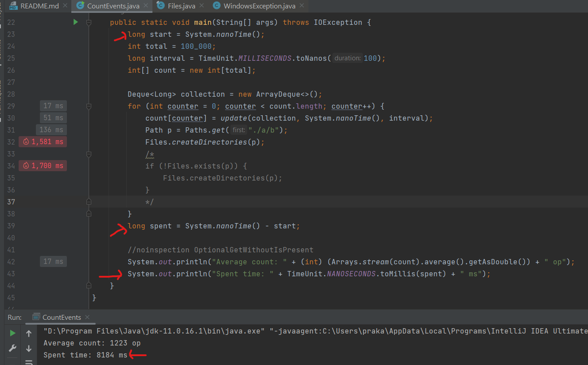
    * Thread dumps (kill -3, JConsole, IDE)
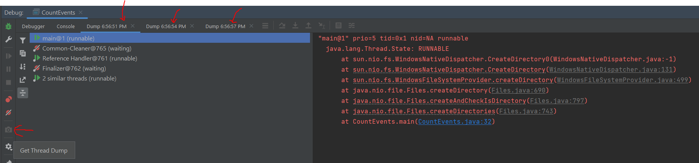
* Automatic (using tools)
  * Code instrumentation and Agents
  * Example tools:
    * Java Flight Recorder (JFR)
    * Async Profiler

---

## Visualize
* Call trees
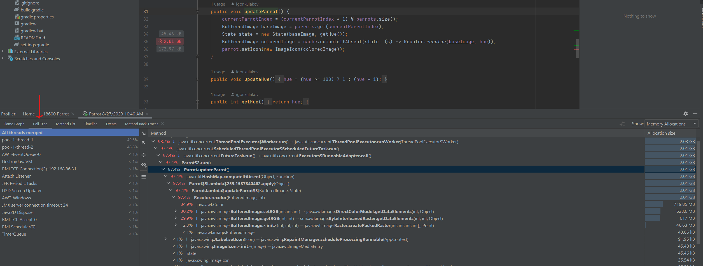
* Flame Graphs
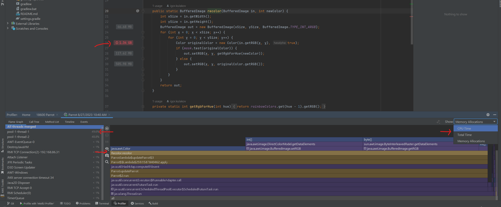
* Icicle Graphs
  * Inverted Flame Graph
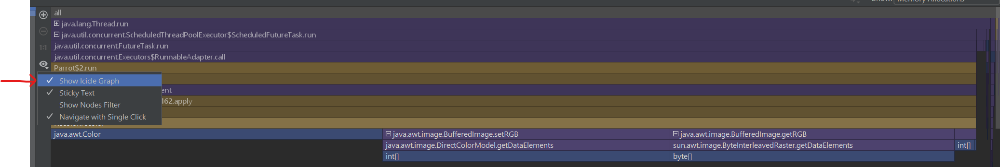
* Histograms
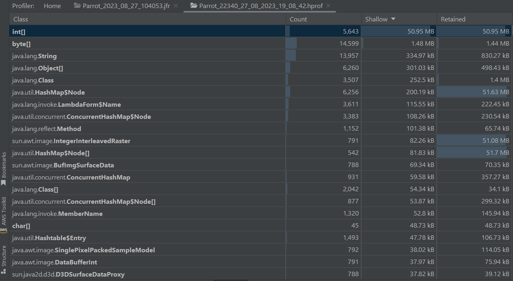
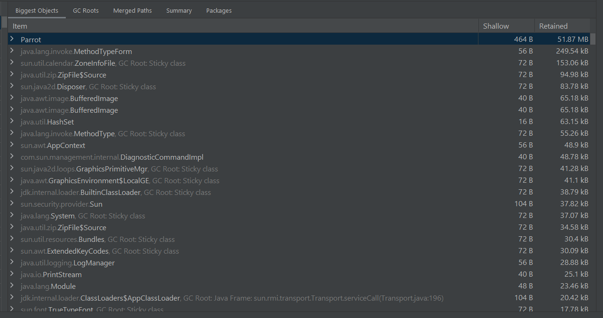
* Pie Charts
  * Sunbursts
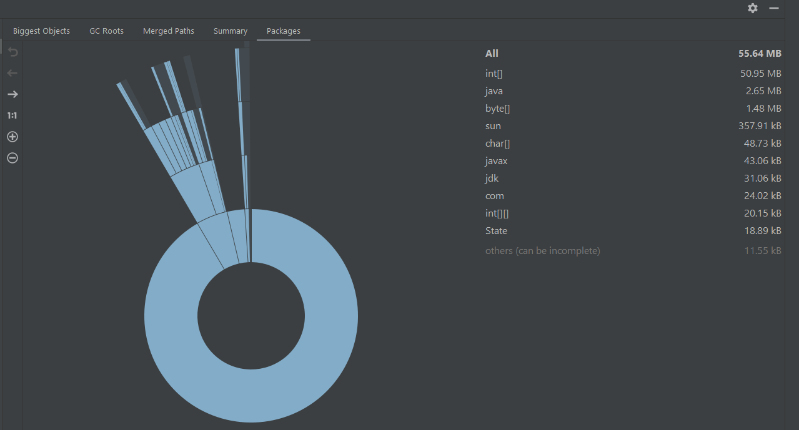
* Timeline
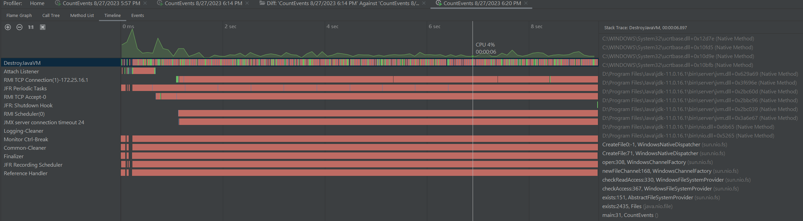

---

## Frame Graphs
* A way to visualize stack traces of profiled software 
* To quickly identify most frequent code-paths
* x-axis 
  * Alphabetical
  * Not passage of time
  * The width of frame implies more often
* y-axis
  * Stack depth
  * Inverted as icicle 
* Colors can help to group by types
  * User code
  * JDK
  * Native code
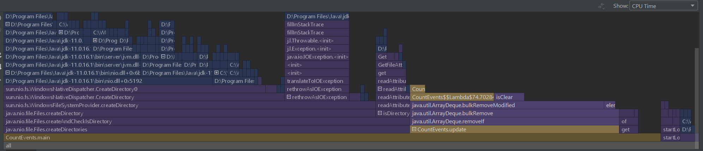
* Flame Graphs can be **diff**
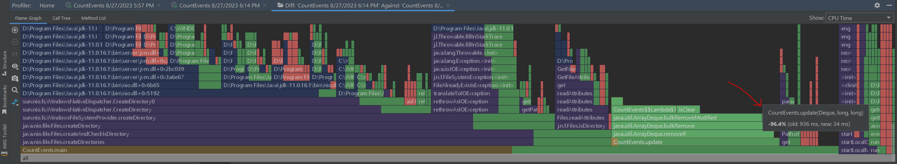

### Flame Graphs Supported In
* IDE
* APM (e.g. Datadog)
* Framework (e.g. Apache Flink)

#### Memory Allocation Icicle Graph (Same as Above)

---

## Challenges and Shortcomings
* More challenging with asynchronous programs
* More challenging with IO and other external integrations
* Knowing and understanding the limitations of technology / methodology (e.g. in Java stack traces may be captured at safe-points)
* Knowing and understanding the environment (e.g. in Java you may be only looking at the view of the world via the JVM)
  * Enable more settings to get complete picture
  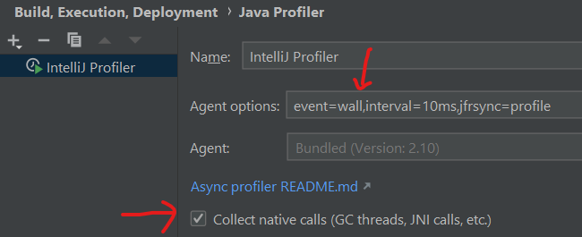
* Distributed systems
  * Microservices based architecture
  * Working with 10s or 100s or more of VMs
* Huge heaps

---

## Suggestions big and small
* Don't start a project without (a good) APM
* What is application doing?
  * Take few quick thread-dumps
* Why is CPU pegged?
  * Check if application is (major) GCing like crazy (the saw teeth pattern)
  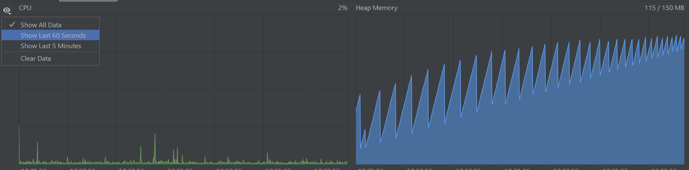
  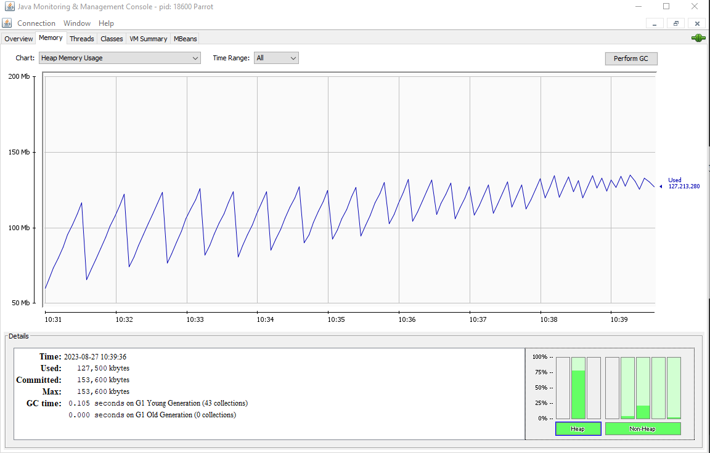
* Have a problem but don't know where to start; are not familiar with code-base
  * Start by taking some profiles (cpu, memory)

---

## References
* [Flame Graphs](https://www.brendangregg.com/flamegraphs.html)
* [JConsole](https://docs.oracle.com/en/java/javase/11/management/using-jconsole.html#GUID-77416B38-7F15-4E35-B3D1-34BFD88350B5)
* [Java Flight Recorder](https://docs.oracle.com/javacomponents/jmc-5-4/jfr-runtime-guide/about.htm#JFRUH170)
* [Async-profiler](https://krzysztofslusarski.github.io/2022/12/12/async-manual.html)
* [Datadog](https://www.datadoghq.com/knowledge-center/distributed-tracing/flame-graph/)
* [Apache Flink](https://nightlies.apache.org/flink/flink-docs-master/docs/ops/debugging/flame_graphs/)
* [Profiling in IntelliJ IDEA](https://www.jetbrains.com/help/idea/profiler-intro.html)
* [Tutorial: Find a memory leak](https://www.jetbrains.com/help/idea/tutorial-find-a-memory-leak.html)
* [Tutorial: Get started with CPU profiling](https://www.jetbrains.com/help/idea/tutorial-get-started-with-profiling.html)